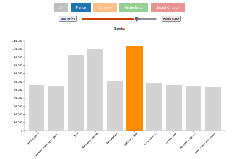
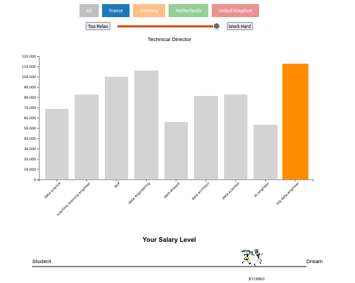
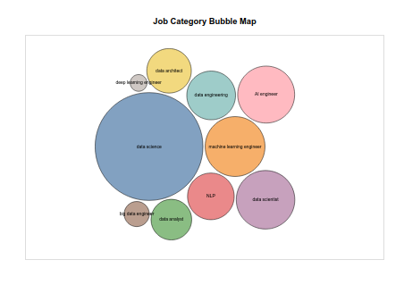
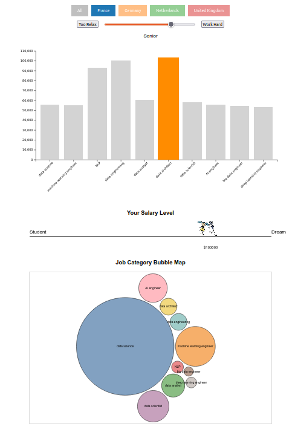

# Interactive Job Data Visualization

This project visualizes job data interactively, allowing users to explore job categories, salary trends, and geographic insights through multiple charts. The project leverages **D3.js** for creating dynamic, data-driven visualizations.

The background of this project is: the newly graduation student they are always confusing about their future. They would think about: what job should they seek for? what is the most popular/most paid job now? How should they achieve their career? This is becoming a social issue recently, especially in the tech domain, which change featest. So we are inspired to implement this platform to help the newly graduations. Good lucky to them and to myself for their career path. 

---

## **Project Features**

1. **Country-wise Job Distribution (Bar Chart)**
   - Displays average salary trends for different job categories grouped by country.
   - Users can filter jobs by country using interactive buttons.
   - Bar colors are dynamically assigned for visual distinction.
   - Users can view average salaries by job category.
   - A slider allows filtering based on job levels (e.g., Internship, Junior, Mid-level, Senior, Technical Director).
   - Hovering on bars highlights job categories and provides tooltips.

   

2. **Salary Level Visualization**

   - The Salary Level visualized by a small running man, which visualized that the career path from a student who is just graduate to the maximum possible salary he/she could achieve.  

   

3. **Job Categories Bubble Map**

   - A bubble map visualizes job categories, where:
     - **Bubble size** represents the number of jobs.
     - **Bubble color** distinguishes job categories.
   - Interactive updates based on the selected country or job level.

   

---

## **How to Run the Project**

1. Ensure you have **Visual Studio Code** and the **Live Server** extension installed.
2. Place all project files (e.g., `index.html`, `script.js`, `job_data.csv`, and images) in a local directory.
3. Open the project folder in **Visual Studio Code**.
4. Open `index.html` and right-click to run it using **Live Server**.
5. The project will open in your default browser.

---

## **Technical Implementation**

1. **Data Loading and Scaling**:
   - Job data is loaded from a CSV file using `d3.csv()`.
   - The dataset includes variables like Country, Job Title, Job Category, Job Level, and Average Salary.

2. **Charts**:
   - **Bar Charts** for visualizing job categories and salaries.
   - **Bubble Map** for displaying job category distribution dynamically.
   - Interactivity includes buttons, sliders, and tooltips for an enhanced user experience.

3. **Design Rationale**:
   - The visual encodings use **color**, **size**, and **position** to represent relationships in the data.
   - Charts provide clear insights into job distributions, salary trends, and categorical groupings.

4. **Beyond Basic Charts**:
   - The implementation of an interactive **Bubble Map** goes beyond basic charts, providing an engaging way to explore job category data.

---

## **Project Requirements and Scoring**

- **Run on Live Server**: ✅ The project can be run using the Live Server extension.
- **Data Loading and Scaling**: ✅ Job data is loaded dynamically and variables are scaled appropriately.
- **Chart Display**: ✅ Multiple charts display data clearly and effectively.
- **Data Details and Design**: ✅ Charts provide detailed visual encodings and rationale for design choices.
- **Advanced Feature**: ✅ The Bubble Map adds a creative, interactive visualization beyond basic charts.

---

## **Technologies Used**

- **D3.js v7**: For creating interactive visualizations.
- **HTML/CSS**: For structuring and styling the application.
- **Live Server**: For running the project locally.

---

## **Conclusion**

This project successfully visualizes job data interactively, providing insights into salary levels, job categories, and country-wise distributions. It uses clean, scalable D3.js implementations for dynamic and user-friendly visualizations.

---

## Overall Visualization

